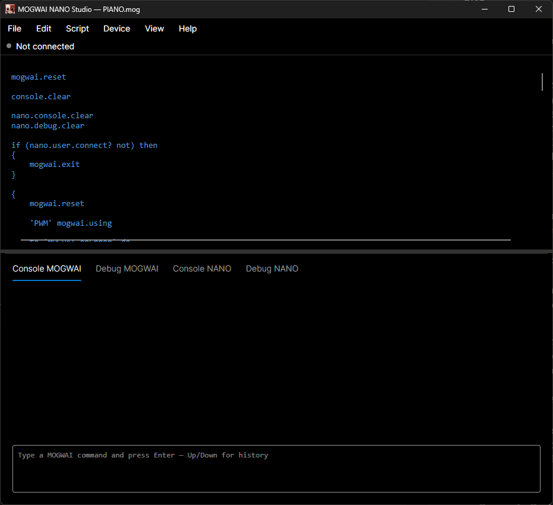
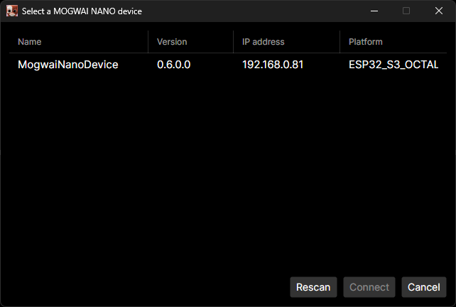
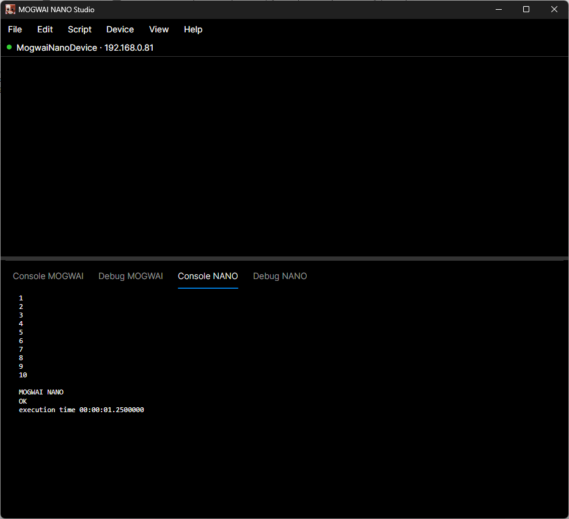

# Getting Started with MOGWAI NANO

This tutorial assumes you already know the basics of MOGWAI itself — the RPN stack model, syntax like `50 -> 'A'`, and control-flow sugar like `if...then...else`. If any of that sounds unfamiliar, spend a few minutes with the [MOGWAI documentation and tutorial](https://github.com/Sydney680928/mogwai) first.

Here, we focus on what's specific to NANO: flashing a device, connecting to it, and driving real hardware.

> Every example below uses **MOGWAI NANO Studio GUI**. The earlier console-based Studio is no longer maintained as of the 0.6 release.

## 1. Flash and configure your device

Follow the [Quick Start](../README.md#quick-start) in the main README to flash `MogwaiNano.bin` and configure WiFi. Once done, power-cycle the device — it will boot straight into MOGWAI NANO and start listening for connections.

## 2. Start MOGWAI NANO Studio

Launch the app. Its window is your workspace for the rest of this guide: a code editor on top, and two live output tabs below it — **Console MOGWAI** (output from code running locally, on your PC) and **Console NANO** (output coming from the connected device).



> ### Where does your code actually run?
>
> This is the single most important thing to understand before going further: **everything you type in the editor runs on your PC**, using the full desktop MOGWAI engine. Typing `code` doesn't mean "code" on the device. It means "code" on your computer, right here, right now.
>
> The **only** way to get code running on a device is to:
> 1. Connect to it (`nano.connect`, `nano.user.select`, etc.)
> 2. Wrap the code you want to run *on the device* inside a block, and pass it to `nano.run`
>
> ```
> "hello from my PC" ?              # runs on your PC — always
> { "hello from the device" ? } nano.run   # runs on the device — only because of nano.run
> ```
>
> Everything outside a `nano.run` block — variables, loops, `if`/`then`, file I/O, even other `nano.*` primitives like `nano.scan` or `nano.user.select` — is regular MOGWAI running locally on your machine. It's a full scripting language in its own right, and you'll use it to *orchestrate* what happens on the device (deciding which one to connect to, what to send, when, and what to do with the result) — not to run things on the device itself. Only the contents of a `nano.run` block ever leave your PC.

### Writing and running code

Type your code straight into the editor. A few shortcuts you'll use constantly:

| Shortcut | Action |
|---|---|
| `F5` | Run the current code |
| `Shift+F5` | Stop the currently running program |
| `Ctrl+N` | New file |
| `Ctrl+O` | Open a file |
| `Ctrl+S` | Save |
| `Ctrl+Shift+S` | Save as |
| `Ctrl+F` | Find in the editor |

`F5` runs whatever's in the editor — locally, or on a device if it contains a `nano.run` block. Local output (`?`, `??`, `debug.write` called outside a `nano.run` block) appears in the **Console MOGWAI** tab; anything printed *on the device* appears automatically in **Console NANO** — no separate step needed to watch it, unlike the old console Studio's `nano.user.view`, which no longer exists.

This is how every example in this guide was actually written and tested — write the block in the editor, hit `F5`, watch the result in the console tabs, adjust, repeat.

The Console NANO tab also has its own input line at the bottom. Anything typed there and sent is run on the device exactly as if you'd wrapped it in `{ ... } nano.run` and hit `F5` in the editor — a quicker way to try a single line on the device without leaving the console tab, especially handy together with keepAlive mode (see the [Device Primitives Reference](device-primitives.md)), where variables and functions carry over from one command to the next. If no device is connected yet, sending a command there triggers the connection dialog automatically — no need to connect first and switch tabs.

## 3. Find your device

You don't need to know your device's IP address. Ask `nano.user.select` to discover it on the network:

```
nano.user.select -> 'device'
if (device ->type .record ==) then { device->ip: nano.connect ? }
```

`nano.user.select` runs a network scan on its own, then opens a dialog listing every device that responded — name, platform, and IP — for you to pick from:



If you pick one, its scan record (device name, version, session, IP, platform, target, OEM, firmware version) is pushed onto the stack. If nothing responds, or you close the dialog without picking one, `null` is pushed instead.

The example checks the type of what's on top of the stack (`.record`) rather than just testing for null — MOGWAI type names are dot-prefixed literals (`.record`, `.string`, `.number`...) that compare directly against `->type`. This guarantees the code that follows really has a proper record with an `ip:` key to work with, rather than just "not null" — a device record could theoretically be null for other reasons than a failed selection, so checking the exact expected type is the more robust habit to build.

If you already know the IP, you can skip discovery entirely:

```
"192.168.1.75" nano.connect
```

Check the connection at any time with:

```
nano.isConnected ?
```

### Scripted discovery (no user interaction)

`nano.user.select` is built for interactive use — it always prompts for input. If you're writing a script that should decide on its own (for example: "if a specific device is on the network, connect to it automatically"), use `nano.scan` directly instead. It returns the raw list of records without ever asking anything, so you can filter it programmatically:

```
nano.scan foreach 'd' do
{
    if (d name: get "MogwaiNanoDevice" ==) then
    {
        d ip: get nano.connect
        break
    }
}
```

## 4. Run your first program on the device

Everything you want to execute *on the device* goes inside a code block, passed to `nano.run`:

```
{ "Hello from the device!" ? } nano.run
```

Behind the scenes, MOGWAI NANO Studio desugars this block into canonical RPN and sends it over the network. `nano.run` only waits long enough to confirm the program has actually started on the device — it does **not** wait for it to finish.

Whatever the device prints — `?`, `??`, `debug.write` — appears on its own in the **Console NANO** tab, as it happens, for as long as MOGWAI NANO Studio stays connected. There's no separate step to attach or watch: it's always live.

```
{ 1 10 for 'i' do { i ? 100 wait } } nano.run
```



This applies the same way whether the program was launched with `nano.run` or is running as a stored autorun program — the moment MOGWAI NANO Studio is connected, its output shows up.

## 5. Blink an LED

Wire an LED (with a current-limiting resistor, ~220Ω for a red LED on 3.3V) between a free GPIO pin and GND. We'll use pin 5 here — adjust to whichever pin you wired.

```
{
    5 gpio.setMode.output
    forever do
    {
        5 gpio.write.high
        500 wait
        5 gpio.write.low
        500 wait
    }
} nano.run
```

The LED should now be blinking, entirely controlled by code running on the device. Notice that `F5` has already returned control to you — this example's `nano.run` call only starts the program and comes right back, it doesn't keep the editor "busy" watching it. To stop the program running *on the device*, use `nano.halt` — also available as **Device > Halt running program** in the menu, with no keyboard shortcut of its own:

```
nano.halt
```

## 6. React to a button press

Wire a push button between another GPIO pin (say, pin 4) and GND, using the device's internal pull-up resistor — no external resistor needed.

```
{
    4 gpio.setMode.inputPullUp
    5 gpio.setMode.output

    onEvent 'GPIO_PIN_CHANGED' do
    {
        if (eventData pin: get 4 ==) then
        {
            if (eventData eventType: get 0 ==)
            then { 5 gpio.write.high }
            else { 5 gpio.write.low }
        }
    }

    forever do { }
} nano.run
```

Pressing the button now lights the LED; releasing it turns it off. The `eventData` variable is automatically populated by the runtime with the pin number and new value whenever a subscribed GPIO event fires — you never have to poll the pin yourself.

> Note the `forever do { }` at the end: without it, the program would reach its natural end and the event subscription would stop existing. An empty infinite loop is a common and cheap way to keep a program — and its event subscriptions — alive.

## 7. Add a recurring timer

Timers run independently of your main program, on their own schedule:

```
{
    timer 'T1' every 5000 do { "still alive" ? }
    'T1' timer.start

    forever do { 250 wait }
} nano.run
```

Every 5 seconds, `"still alive"` is printed to Console NANO — interleaved with whatever else the program is doing — regardless of what the main `forever do` loop is up to. The timer keeps firing on the device whether or not MOGWAI NANO Studio is connected to watch it; reconnecting later simply resumes seeing its output.

## 8. Talk to an I2C device

Wire an I2C device to your board's SDA/SCL pins — a real-time clock module (DS3231) is used here, a cheap and common way to add battery-backed timekeeping to a project.

I2C devices are opened with a name, a bus number, and a 7-bit address — the name is what you'll use afterward, so you never have to repeat the bus/address pair on every call:

```
{
    'RTC' 1 0x68 i2c.open

    'RTC' 0x00 D:00 i2c.register.write
    5000 wait
    'RTC' 0x00 1 i2c.register.read bcd-> ?

    'RTC' i2c.close
} nano.run
```

This writes `0` to the RTC's seconds register, waits 5 seconds, then reads that same register back. RTC chips store time values in **BCD** (binary-coded decimal) rather than plain binary — `bcd->` converts a BCD-encoded number to a regular one (the opposite direction, `->bcd`, exists too). Without it, you'd see the raw encoded byte rather than a readable number; here, the output is `5`.

Not sure what's out there on the bus? `i2c.scan` probes the standard address range (`0x08` to `0x77`) and returns the ones that responded:

```
{ 1 i2c.scan ? } nano.run
```

The other I2C primitives — `i2c.write`, `i2c.read` — work the same way as their `register` counterparts, but operate on the device directly rather than a specific register; useful for devices that don't follow the register-addressed pattern.

I2C writes aren't limited to single bytes — a `MOGData` of any size can be sent in one call, useful for devices like OLED displays that need a whole frame buffer written at once. `makeData` creates a `MOGData` of a given size filled with a given byte value directly, which is the safer choice for larger buffers on lower-RAM devices (building the same buffer by pushing hundreds of individual values with `repeat` before converting with `->data` works fine on more capable boards, but can run out of memory on smaller ones):

```
{
    'OLED' 1 0x3C i2c.open

    # ... display initialization sequence omitted ...

    1024 0 makeData -> 'buffer'
    'OLED' 0x40 &buffer i2c.register.write   # clears the entire 128x64 frame buffer in one transaction

    'OLED' i2c.close
} nano.run
```

## 9. Drive a 128x64 OLED display

That last example shows what driving a display in pure I2C looks like — enough to prove the concept, but drawing anything more than a solid block gets slow and tedious fast. For a common 128x64 SSD1306 OLED display specifically, MOGWAI NANO includes a dedicated set of native primitives instead, built on a real display driver rather than hand-rolled I2C commands. This is the one part of MOGWAI NANO that's tied to a specific piece of hardware — it only supports the SSD1306 at 128x64 over I2C Fast Mode, not OLED displays in general.

```
{
    1 0x3C ssd1306.init

    0 0 "Hello, MOGWAI!" 1 false ssd1306.drawString
    10 20 40 15 true ssd1306.drawFilledRectangle
    ssd1306.refresh

    5000 wait
    ssd1306.close
} nano.run
```

`ssd1306.drawString` takes pixel coordinates for precise placement (`x y text size center`) — there's also `ssd1306.printString`, which uses character-grid coordinates instead (`x=0 y=1` meaning the start of the second text line), closer to writing to a text console. Both only update the in-memory frame buffer; nothing appears on the physical screen until `ssd1306.refresh` is called, so you can batch several drawing calls together before paying for a single screen update.

The rest of the family covers the basics: `ssd1306.clear`, `ssd1306.drawPixel`, `ssd1306.drawHorizontalLine`/`ssd1306.drawVerticalLine`, `ssd1306.drawRectangle` (outline) and `ssd1306.drawFilledRectangle`, and `ssd1306.drawBitmap` for drawing a raw `MOGData` buffer as a 1-bit-per-pixel image.

## 10. Make it survive without a PC connected

Once you're happy with a program, you can store it on the device so it runs automatically on every boot — no MOGWAI NANO Studio connection required afterward:

```
{
    5 gpio.setMode.output
    forever do { 5 gpio.write.high 500 wait 5 gpio.write.low 500 wait }
} nano.autorun.set
```

`nano.autorun.set` only **stores** the code — it doesn't start running it. It will run automatically the next time the device boots, but not before. If you want it to start right away rather than waiting for the next power cycle, follow it with a reboot:

```
nano.autorun.set
nano.reboot
```

From then on, the device blinks the LED on its own every time it's powered on — even without WiFi, since the code is already stored on the device.

To check what's currently stored, or remove it:

```
nano.autorun.get      # returns the stored code as a MOGCode block
nano.autorun.purge    # clears it
```

## 11. Naming your device and checking its free memory

Once you have more than one device on your network, telling them apart by IP alone gets tedious. Give a device a persistent name — it survives reboots, and shows up as the `device` field in future `nano.scan`/`nano.user.select` results:

```
nano.name.set "Greenhouse Sensor"
nano.name ?
```

Every device starts out named `"MogwaiNanoDevice"` until you set something else.

You can also check how much RAM is currently free on the device — useful when writing long-running scripts, or just to keep an eye on things:

```
nano.memory ?
```

This is a lightweight, non-blocking query (it doesn't force a garbage collection on the device the way `mogwai.memory` does from within a running program) — safe to call frequently, even in a polling loop.

If your program is running *on the device* itself (typically as a stored autorun program, with no Studio connection to fall back on), `mogwai.info` gives you everything in a single call — a record with the device's system version, IP, name, platform, session, free memory, target, MOGWAI NANO version, OEM build details, and the device's skills:

```
{ mogwai.info ? } nano.run
```

```
[system: "1.17.0.334" ip: "192.168.1.75" name: "DEVICE1" platform: "ESP32" session: "39122" memory: 49872 target: "ESP32_REV3" mogwai: "0.2.0.0" oem: "MinSizeRel build, chip rev. >= 3, without support for PSRAM" skills: ("GPIO" "I2C")]
```

This shows up in the Console NANO tab the moment the device prints it — no extra step needed.

## 12. Reboot cleanly

If your program needs to reboot the device itself (for example, after applying a new configuration), call `mogwai.reboot` from within the running script. If you've defined a `MOGWAI.onReboot` function, it runs first, giving you a chance to clean up:

```
{
    to 'MOGWAI.onReboot' do { "Rebooting, bye!" ? }
    mogwai.reboot
} nano.run
```

If you need to force a reboot or halt from MOGWAI NANO Studio *without* running any device-side code — for example, if a device seems stuck — use `nano.reboot` or `nano.halt` instead, or their menu equivalents, **Device > Reboot** and **Device > Halt running program** (neither has a keyboard shortcut). These act immediately and bypass `MOGWAI.onReboot` entirely.

This is particularly useful when connecting to a device that's already busy — for example, one running a stored autorun program from the moment it booted. `nano.state` would report `RUNNING`, and `nano.run` would refuse to start anything new (raising an error) until that program stops. `nano.halt` stops it immediately, bringing the device back to `IDLE` and ready for your next `nano.run`:

```
nano.halt
nano.state ?
```

## 13. Putting it all together

Here's a complete, self-contained script that ties together everything covered so far: it checks whether you're already connected, discovers and connects to a device if not (handling both a failed connection and an aborted selection), then runs a program and watches its output.

```
mogwai.reset
console.clear

if (nano.isConnected not) then
{
    nano.user.select -> 'device'

    if (device ->type .record ==) then
    {
        "" ?
        "Connecting to selected device..." ?

        if (device->ip: nano.connect not) then
        {
            "Connection error !" ?
            mogwai.exit
        }
        else
        {
            "Device connected." ?
            "" ?
        }
    }
    else
    {
        "" ?
        "Connection aborted !" ?
        mogwai.exit
    }
}

{
    1 10 for 'i' do
    {
        i ?
        500 wait
    }
}

guard
{
    nano.run
}
else
{
    "" ?
    "Unable to run !" ?
}
```

This is entirely regular MOGWAI code — `if`/`then`/`else`, `mogwai.exit` for early exit on failure, `guard`/`else` to catch a failure in `nano.run` itself (for example, if the device drops off the network right as the script tries to run something) — orchestrating the connection and the discovery UI on your PC, with only the small inner block ever actually running on the device. Its output shows up in Console NANO on its own, without needing anything else. A good pattern to reuse and adapt as your own scripts grow.

### The shortcut version

Everything in the connection block above — scan, list, select, connect — is exactly what `nano.user.connect` does in a single call:

```
if (nano.isConnected not) then { nano.user.connect }
```

Same guided experience, same `true`/`false` outcome as `nano.connect`, one line instead of the block spelled out above.

That `if (nano.isConnected not) then { ... }` wrapper is common enough that it has its own shortcut too: `nano.user.connect?` does exactly that — connects only if there isn't already a connection, pushing `true` right away with no scan and no dialog if there is one. The line above becomes:

```
nano.user.connect?
```

A good habit to lead a script with: it's safe to call at the top of anything, whether or not a device happens to already be connected. Now that you've seen what it does under the hood, use whichever of the three fits your script better.

## What's next

- Browse the [Device primitives reference](device-primitives.md) for the complete list of everything available in the device runtime
- Check the [CHANGELOG](../CHANGELOG.md) for the full list of NANO-specific primitives (`gpio.*`, `timer.*`, `nano.*`, event handling)
- I2C, SPI, PWM and ADC support is on the roadmap — GPIO is fully available today
